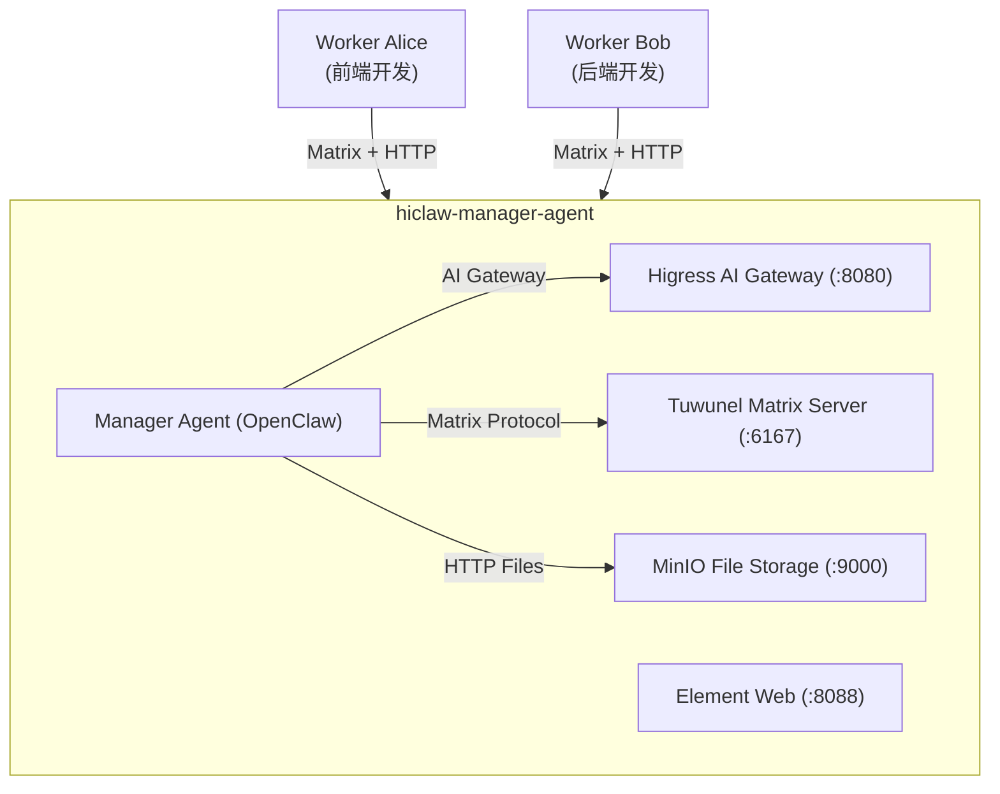
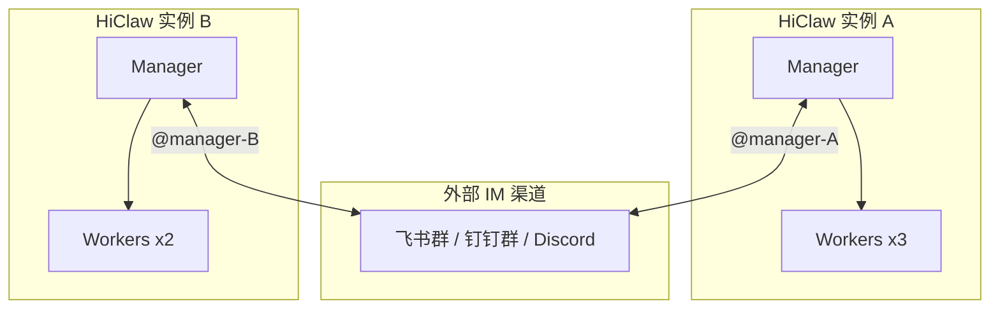
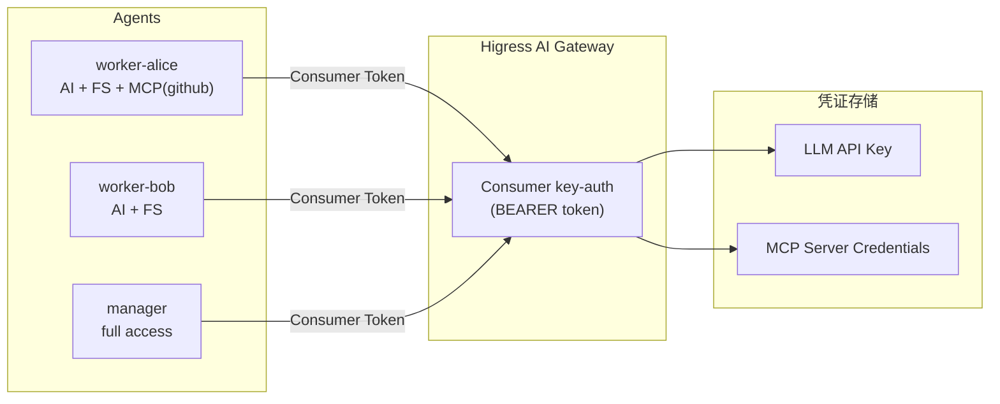
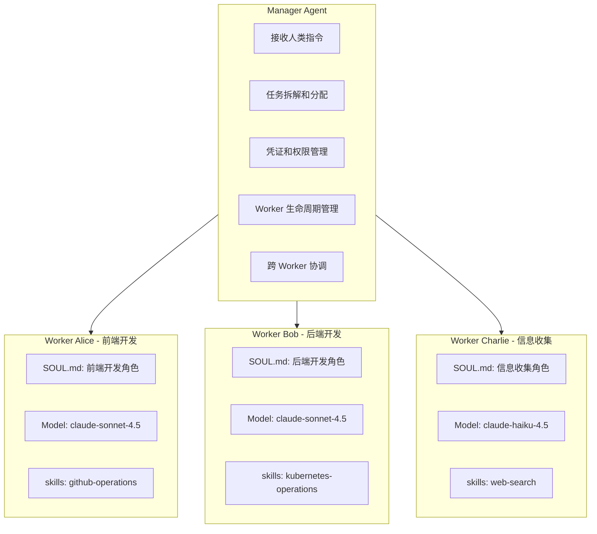
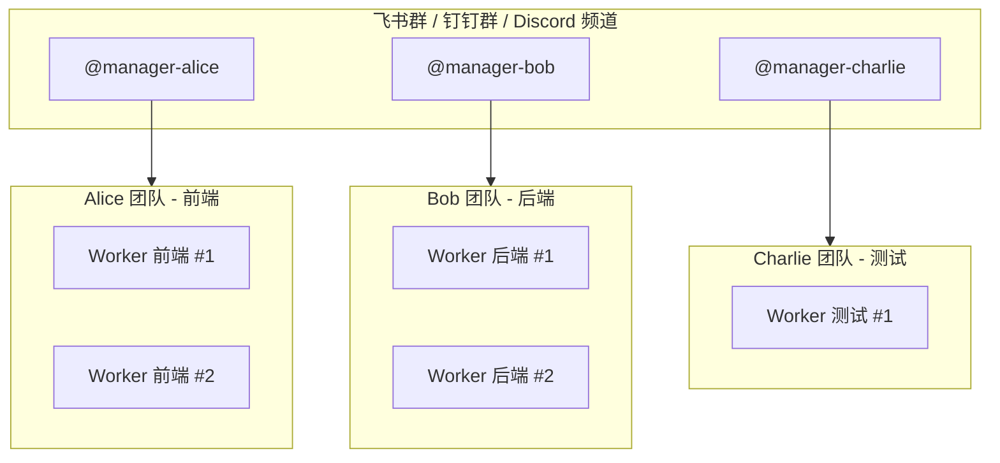
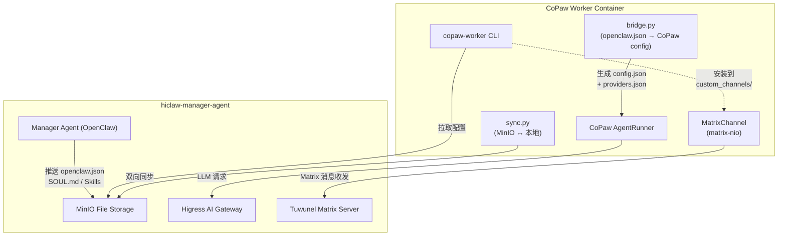

## 背景与问题

在使用 OpenClaw 过程中，会遇到三个核心问题：

### 问题一：凭证安全管理

OpenClaw 采用"self-hackable"架构，每个 agent 独立持有凭证：
- 每个 agent 需要配置自己的 LLM API Key
- 调用 GitHub、GitLab 等外部服务时，需要在 agent 配置中存储 PAT/Token
- 2026 年 1 月披露的 CVE-2026-25253 漏洞，结合 supply-chain poisoning 攻击，暴露了这种架构的安全风险
- Palo Alto Networks 研究指出，持久记忆（MEMORY.md）可能成为攻击载荷的潜伏载体

### 问题二：Skills 和 Memory 的职责混淆

当一个 OpenClaw 实例承担多种角色时：
- `skills/` 目录积累大量技能，很多与当前任务无关
- `MEMORY.md` 混杂不同领域的记忆，互相干扰
- 每次 heartbeat 或任务触发时加载大量无关上下文，浪费 token
- 官方讨论区反馈：workspace 文件浪费约 93.5% 的 token 预算

### 问题三：移动端交互体验

通过飞书、钉钉等企业 IM 接入 OpenClaw，存在两方面问题：

**接入流程复杂**：
- **飞书**：需登录开放平台 → 创建企业自建应用 → 配置机器人 → 申请权限 → 提交版本审核 → 等待企业管理员审批
- **钉钉**：企业内部应用限制多，ISV 接入需要服务商认证、产品方案审核、测试企业授权等流程
- 整个流程可能需要数天到数周，且依赖企业 IT 配合

**使用体验不佳**：
- 消息延迟高，经常被折叠到"服务号"
- 需要多层导航才能找到机器人对话
- 交互流程长，难以做到"随手指挥"
- 这些 IM 本质上是为企业协作设计，不是为 AI Agent 交互优化

## HiClaw 架构设计

### 整体架构

**单实例架构**（个人/小团队）：



**多实例协作架构**（团队/企业）：



Manager 通过 OpenClaw channel 插件连接外部 IM，实现跨实例协作。

### 核心组件

| 组件 | 技术选型 | 职责 |
|------|---------|------|
| AI Gateway | Higress | LLM 代理、MCP Server 托管、Consumer 认证 |
| Matrix Server | Tuwunel (conduwuit fork) | Agent 间 IM 通信 |
| IM Client | Element Web + Mobile | 人机交互界面 |
| File System | MinIO + mc mirror | 集中式配置和状态存储 |
| Agent Runtime | OpenClaw (Node.js) | Manager 和 Worker 的运行时 |
| Agent Runtime | CoPaw (Python) + copaw-worker 桥接包 | Worker 的轻量 Python 运行时 |
| Channel Plugin | OpenClaw channel | 连接外部 IM（Discord/飞书/钉钉/Telegram）|

## 解决方案

### 一、安全模型：AI Gateway + Consumer Token

**设计原则**：Worker 永远不持有真实凭证



**凭证管理流程**：
1. 真实凭证（GitHub PAT、LLM API Key）仅存储在 Higress 配置中
2. 每个 Worker 持有独立的 Consumer token
3. Manager 通过 Higress API 控制每个 Consumer 的访问权限
4. Worker 调用 LLM 或 MCP Server 时，使用 Consumer token 通过 Gateway 代理

**安全优势**：
- 凭证集中管理，审计只需检查一处
- Worker 被攻击后，只需撤销该 Worker 的 Consumer
- 可实现细粒度权限控制（某个 Worker 只能访问特定 MCP Server）

### 二、职责隔离：领域垂直的 Worker

**设计原则**：每个 Worker 专注一个领域，使用最适合的模型



**模型选择策略**：

| Worker 类型 | 推荐模型 | 原因 |
|------------|---------|------|
| 代码开发 | Claude Sonnet / Opus | SOTA 代码能力，复杂推理 |
| Code Review | Claude Sonnet | 代码理解能力强 |
| 信息收集 | Claude Haiku / Gemini Flash | 长上下文，成本低 |
| 文档撰写 | Claude Haiku / GPT-4o-mini | 性价比高 |
| 监控告警 | Claude Haiku | 简单任务，无需强模型 |

**成本优化**：

假设一个项目需要：
- 3 次代码开发任务（每个 50k tokens）
- 10 次信息收集任务（每个 100k tokens）

**原生 OpenClaw**（统一用 Sonnet）：
```
代码: 3 × 50k × $3/M = $0.45
信息: 10 × 100k × $3/M = $3.00
总计: $3.45
```

**HiClaw**（按任务分配模型）：
```
代码: 3 × 50k × $3/M = $0.45 (Sonnet)
信息: 10 × 100k × $0.25/M = $0.25 (Haiku)
总计: $0.70
```

**节省 80% 成本**，同时保证代码质量。

**状态管理**：
- Worker 配置和记忆存储在 MinIO
- Worker 容器本身是 stateless
- 可随时销毁重建，不丢失状态
- 模型配置在 Worker 创建时指定，可随时调整

**对比**：

| 维度 | OpenClaw 原生 | HiClaw |
|------|--------------|--------|
| Agent 角色 | 一个实例承担所有角色 | 每个 Worker 专注一个领域 |
| 模型选择 | 统一模型，一刀切 | 按 Worker 任务类型分配最优模型 |
| 成本效率 | 简单任务也用昂贵模型 | 简单任务用便宜模型，节省 60-80% |
| Skills | 手动管理，容易冗余 | Manager 中心化分配 |
| Memory | 所有记忆混在一起 | 每个 Worker 独立 |
| 扩展方式 | 垂直扩展（加技能） | 水平扩展（加 Worker）|

### 三、交互体验：Matrix 协议 + 丰富的客户端生态

**设计原则**：使用专为 IM 设计的客户端，开箱即用

**技术实现**：
- Manager 容器内置 Tuwunel（Matrix Homeserver）
- Element Web 作为浏览器端客户端，无需额外安装
- 可选择任意 Matrix 客户端接入

**Matrix 客户端生态**：

Matrix 协议拥有丰富的客户端生态，覆盖所有主流平台：

| 客户端 | 支持平台 | 特点 |
|--------|---------|------|
| Element | Web/iOS/Android/Desktop | 官方客户端，功能最全 |
| FluffyChat | Web/iOS/Android/Linux/Windows/macOS | 轻量级，跨平台 |
| Nheko | Linux/macOS/Windows | 原生性能，低资源占用 |
| Fractal | Linux | GNOME 风格，Rust 实现 |
| NeoChat | Linux/Android/Windows | KDE 生态，移动端友好 |
| SchildiChat | Web/Android/Desktop | Element 分支，优化 UI |
| gomuks | Linux/macOS/Windows | 终端客户端，适合服务器使用 |
| Thunderbird | Linux/macOS/Windows | 邮件客户端集成 Matrix |

**对比飞书/钉钉**：

| 维度 | 飞书/钉钉 | Matrix (HiClaw) |
|------|----------|-----------------|
| 接入流程 | 企业认证 + 审核流程，数天到数周 | 部署即用，零配置 |
| 客户端选择 | 官方客户端唯一 | 多客户端可选，按需选择 |
| 消息延迟 | 经常延迟、折叠 | 秒级推送 |
| 导航层级 | 多层菜单 | 直接进入对话 |
| 交互设计 | 企业协作优先 | IM 优先 |
| 离线支持 | 依赖企业服务器 | 可自建服务器，完全自主 |

**Human-in-the-Loop 支持**：
- 每个 Worker 有专属 Room（Human + Manager + Worker 三方）
- 所有 Agent 通信在 Room 中可见
- 人类可随时发消息干预

## 使用场景

### 场景一：个人开发工作流

```
用户在 Element 发送指令：
"今天完成用户认证模块"

Manager：
1. 拆解为前端（登录页）+ 后端（API）两个任务
2. 分配给 Worker Alice 和 Worker Bob

Alice 和 Bob：
1. 各自在 Room 中报告进度
2. 完成后通知用户

用户：
1. 在手机上实时查看进度
2. 随时干预或补充信息
3. Review 结果后确认
```

### 场景二：多人团队协作

HiClaw 支持多 Manager 协作模式，每个团队成员拥有独立的 Manager + Workers 组合：



**工作模式**：

1. **每人一个 Manager**：
   - Alice 带领前端团队（Manager + 2 个前端 Worker）
   - Bob 带领后端团队（Manager + 2 个后端 Worker）
   - Charlie 带领测试团队（Manager + 1 个测试 Worker）

2. **跨 Manager 协作**：
   - 所有 Manager 加入同一个飞书群/钉钉群
   - Bob 需要前端配合时，在群里 @manager-alice
   - Alice 的 Manager 收到消息后，分配给对应 Worker 执行
   - Worker 完成后通知 Alice，Alice 在群里回复 Bob

3. **技术实现**：
   - Manager 通过 OpenClaw 的 channel 插件连接外部 IM
   - 支持 Discord、飞书、钉钉、Telegram、Slack 等多种 channel
   - 有身份识别机制，区分 admin / trusted-contact / 未知用户
   - 支持 Cross-Channel Escalation：紧急问题可从 Matrix room 升级到 admin 的主频道

**对比传统模式**：

| 维度 | 传统模式 | HiClaw 多 Manager |
|------|---------|-------------------|
| 任务分配 | 人工协调 | Manager 自动分配给 Worker |
| 进度同步 | 会议/群聊 | Worker 完成后自动通知 |
| 跨团队协作 | 群里@人 | 群里@对方的 Manager |
| 个人 AI | 每人独立配置 | 每人有独立 Manager + Workers |
| 知识沉淀 | 散落在各处 | 每人 Manager 有独立记忆 |

### 场景三：企业安全合规

- 所有凭证在 Higress 统一管理
- 安全团队只需审计 Gateway 配置
- 可按 Worker 设置细粒度权限

## 部署与使用

### 安装 Manager

```bash
# 一键安装
bash <(curl -sSL https://higress.ai/hiclaw/install.sh)

```

### 创建 Worker

在 Element 中与 Manager 对话：

```
用户: 创建一个名为 alice 的 Worker，负责前端开发，需要 GitHub 访问权限
Manager: Worker alice 已创建，Room: !xxx:matrix-local.hiclaw.io
```

### 分配任务

```
用户: @alice 实现 login 页面的前端代码
Alice: [处理中...]
Alice: 完成，PR: https://github.com/xxx/pull/123
```

## 架构对比

| 维度 | OpenClaw 原生 | HiClaw |
|------|--------------|--------|
| 部署 | 单进程 | 分布式容器 |
| 拓扑 | 扁平对等 | Manager + Workers |
| 凭证管理 | 每个 agent 持有 | AI Gateway 集中管理 |
| 模型选择 | 统一模型 | 按 Worker 任务类型分配最优模型 |
| 成本效率 | 简单任务也用昂贵模型 | 简单任务用便宜模型，节省 60-80% |
| Skills | 手动配置 | Manager 按需分配 |
| Memory | 混合存储 | Worker 独立隔离 |
| 通信 | 内部总线 | Matrix 协议 |
| 移动端 | 企业 IM | Element + 多客户端可选 |
| 故障隔离 | 共享进程 | 容器级隔离 |
| 多实例协作 | 不支持 | 通过外部 IM 渠道互联 |
| Worker 运行时 | OpenClaw (Node.js) | OpenClaw + CoPaw (Python) 双运行时 |
| 外部渠道 | 需自行配置 | 开箱即用（channel 插件）|

## CoPaw 集成

### 为什么集成 CoPaw

**1. 资源开销大**

OpenClaw Worker 单实例约占用 **500MB 内存**。当 Manager 管理多个 Worker 时，内存消耗快速增长。对于信息收集、文档处理等轻量任务，这种开销不合理。

**2. 远程部署需求**

某些场景需要 Worker 直接运行在用户本地机器上（如打开浏览器、操作桌面应用、访问本地文件），容器化部署无法满足。

CoPaw 作为 Python 原生的 Agent 框架，天然解决了上述问题：轻量（~150MB）、Python 生态完整、内置文档处理技能（pdf/xlsx/docx）、可通过 pip 安装到任意机器。

### 集成要解决的核心问题

将 CoPaw 接入 HiClaw 体系，核心挑战是让 CoPaw Worker 能无缝融入已有的 **Manager-Worker 协作架构**，具体包括：

| 问题 | 描述 |
|------|------|
| 配置桥接 | HiClaw 使用 `openclaw.json` 统一管理 Worker 配置，CoPaw 使用自己的 `config.json` + `providers.json` |
| Matrix 通信 | CoPaw 没有内置 Matrix Channel，需要实现并符合 HiClaw 的 @mention 唤醒协议 |
| 文件同步 | Worker 配置和技能存储在 MinIO，CoPaw 需要双向同步机制 |
| 技能管理 | Manager 通过 MinIO 推送技能给 Worker，CoPaw 需要兼容这套分发机制 |
| 生命周期管理 | Manager 需要像管理 OpenClaw 一样创建、启停、销毁 CoPaw Worker |
| 内存优化 | CoPaw 依赖链较重（chromadb、pandas、elasticsearch 等），headless 模式需要裁剪 |

### 集成架构



### 集成方案详解

#### 1. copaw-worker 桥接包

我们开发了 `copaw-worker` Python 包作为 HiClaw 与 CoPaw 之间的桥接层。它以 `copaw` 为依赖，不修改 CoPaw 源码，通过外部桥接实现集成：

```
pip install copaw-worker
copaw-worker --name alice --fs http://fs-local.hiclaw.io:18080 --fs-key alice --fs-secret xxx
```

包结构：

| 模块 | 职责 |
|------|------|
| `cli.py` | Typer CLI 入口，解析参数，启动 Worker |
| `worker.py` | 启动编排：拉取配置 → 桥接 → 安装 Channel → 同步技能 → 启动 CoPaw |
| `bridge.py` | 将 `openclaw.json` 翻译为 CoPaw 的 `config.json` + `providers.json` |
| `matrix_channel.py` | CoPaw BaseChannel 实现，基于 matrix-nio |
| `sync.py` | 基于 mc CLI 的 MinIO 双向文件同步 |

#### 2. 配置桥接（bridge.py）

HiClaw 用 `openclaw.json` 统一描述 Worker 的 LLM 提供者、Matrix 通道、模型选择等配置。CoPaw 使用自己的格式。`bridge.py` 负责实时翻译：

```
openclaw.json                    CoPaw config.json
┌─────────────────────┐          ┌──────────────────────────┐
│ channels.matrix:    │    →     │ channels.matrix:         │
│   homeserver        │          │   homeserver             │
│   accessToken       │          │   access_token           │
│   groupAllowFrom    │          │   group_allow_from       │
│   historyLimit      │          │   history_limit          │
│                     │          │                          │
│ models.providers:   │    →     │ agents.running:          │
│   contextWindow     │          │   max_input_length       │
│   input: ["image"]  │          │   vision_enabled: true   │
└─────────────────────┘          └──────────────────────────┘

                                 CoPaw providers.json
                                 ┌──────────────────────────┐
                                 │ custom_providers:        │
                                 │   base_url, api_key      │
                                 │ active_llm:              │
                                 │   provider_id, model     │
                                 └──────────────────────────┘
```

关键技术点：

- **运行时路径修补**：CoPaw 在 import 时就捕获了 `WORKING_DIR`、`SECRET_DIR` 等路径常量，设置环境变量已经来不及。`bridge.py` 直接修补 `copaw.constant`、`copaw.providers.store`、`copaw.envs.store` 模块的运行时变量，让 CoPaw 读写正确的目录
- **端口重映射**：容器内部 `:8080` 端口在宿主机映射为 `:18080`，bridge 根据是否在容器内（检测 `/.dockerenv` / `/run/.containerenv`）自动重映射 URL
- **模型能力感知**：从 `openclaw.json` 的模型 `input` 字段提取视觉能力，桥接为 `vision_enabled`，控制 MatrixChannel 是否下载和发送图片

#### 3. Matrix Channel 实现（matrix_channel.py）

CoPaw 原生不支持 Matrix 协议。我们实现了完整的 `MatrixChannel`，作为 CoPaw 的 `BaseChannel` 子类，通过 custom_channels 机制注入：

**核心能力**：

| 功能 | 实现方式 |
|------|---------|
| 消息收发 | matrix-nio AsyncClient，全异步 |
| @mention 唤醒 | 支持 m.mentions（结构化）、matrix.to 链接、全文 MXID 匹配三种方式 |
| 历史上下文 | 未 @mention 的消息缓存为历史，@mention 时作为上下文前置（与 OpenClaw 格式一致） |
| 多媒体支持 | 图片/文件/音频/视频的下载、上传和类型映射 |
| 视觉模型 | vision_enabled 时下载图片为本地文件，构建 ImageContent 发给 LLM |
| 交互反馈 | 已读回执 + 打字指示器（自动续期，2 分钟上限） |
| 权限控制 | DM/群组双重 allowlist，per-room 的 requireMention 配置 |

**历史上下文格式**（与 OpenClaw 保持一致，Agent 可统一解析）：

```
[Chat messages since your last reply - for context]
admin: 帮我看看这个 bug
manager: @alice 请检查一下登录模块

[Current message - respond to this]
manager: @alice 你开始了吗？
```

#### 4. 文件同步（sync.py）

Worker 的配置、SOUL.md、AGENTS.md、技能文件存储在 MinIO 中，由 Manager 管理。CoPaw Worker 需要：

- **启动时**：从 MinIO 拉取全部配置
- **运行中**：周期性拉取（检测配置变更 → 自动 re-bridge）+ 本地变更推送到 MinIO

```
MinIO: hiclaw-storage/agents/<worker-name>/
├── openclaw.json          ← Manager 写入
├── SOUL.md                ← Manager 写入
├── AGENTS.md              ← Manager 写入
├── skills/<skill>/SKILL.md ← Manager 推送
├── memory/                → Worker 写入
└── task-history.json      → Worker 写入
```

同步实现基于 `mc` CLI 而非 HTTP API，避免了 AWS Signature V4 签名的复杂性。push loop 每 5 秒检测本地变更并上传，排除 Manager 拥有的文件（`openclaw.json`、`AGENTS.md`、`SOUL.md`）。

#### 5. 技能管理

CoPaw Worker 的技能分两层：

1. **CoPaw 内建技能**（底层）：pdf、xlsx、docx 等文档处理技能，启动时通过 `sync_skills_to_working_dir()` 注入
2. **Manager 推送技能**（上层覆盖）：HiClaw 特有技能（file-sync、github-operations 等），从 MinIO 拉取后覆盖写入

Manager 更新技能后推送到 MinIO，sync loop 检测到变更自动重新同步。

#### 6. 容器化与内存优化

**两种运行模式**：

| 模式 | 条件 | venv | 特点 |
|------|------|------|------|
| Standard | `HICLAW_CONSOLE_PORT` 已设置 | `/opt/venv/standard` | PyPI CoPaw + Web 控制台（FastAPI + uvicorn） |
| Lite（默认） | 无 console port | `/opt/venv/lite` | GitHub Fork CoPaw + headless（无 HTTP 服务器） |

**Lazy-loading 优化**（仅 Lite 模式，节省约 170MB RSS）：

我们编写了三个 patch 脚本，在镜像构建时修改 CoPaw 依赖包的 import 行为：

| Patch | 目标包 | 延迟加载的模块 | 节省内存 |
|-------|--------|---------------|---------|
| `patch_reme_lazy.py` | reme（CoPaw 记忆后端） | chromadb, pandas, elasticsearch, qdrant, mcp | ~100MB |
| `patch_agentscope_lazy.py` | agentscope | redis, socketio, sqlalchemy, mcp, embedding | ~40MB |
| `patch_agentscope_runtime_lazy.py` | agentscope_runtime | opentelemetry, fastapi, deployers | ~100MB（headless 下完全跳过） |

这些 patch 不修改 CoPaw 源码，而是在 `site-packages` 中注入 lazy import wrapper。headless Worker 永远不会用到这些模块，但它们在 import 时就被加载，造成不必要的内存浪费。

#### 7. 部署方式

**容器部署**（推荐）：

Manager 通过 Docker/Podman Socket API 创建 CoPaw 容器，与 OpenClaw 容器使用相同的生命周期管理（start/stop/exec）：

```bash
# Manager 内部调用
bash create-worker.sh --name alice --runtime copaw --skills github-operations
```

**远程部署**（本地机器）：

适用于需要访问用户本地环境的场景：

```bash
# 用户在本地机器执行
pip install copaw-worker
copaw-worker --name alice \
  --fs http://your-manager-ip:18080 \
  --fs-key alice \
  --fs-secret <secret> \
  --console-port 8088
```

远程 Worker 通过网络连接 Manager 的 MinIO 和 Matrix Server，生命周期由用户自行管理。

### 集成效果

#### 资源对比

| 指标 | OpenClaw Worker | CoPaw Worker (Lite) | 节省 |
|------|----------------|--------------------|----|
| 内存占用 | ~500MB | ~150MB | **70%** |


#### 功能对等性

CoPaw Worker 目前已实现与 OpenClaw Worker 完整的功能对等：

| 功能 | OpenClaw Worker | CoPaw Worker |
|------|----------------|-------------|
| Matrix 通信 | 内置插件 | MatrixChannel (matrix-nio) |
| @mention 协议 | 原生支持 | 完整支持（三种检测方式） |
| 历史上下文 | 原生支持 | 兼容格式实现 |
| MinIO 文件同步 | 内置 | mc CLI 双向同步 |
| Manager 推送技能 | 自动加载 | 自动同步 + 覆盖 |
| LLM 调用 | 直连 Gateway | 直连 Gateway |
| MCP 工具调用 | mcporter CLI | mcporter CLI |
| 多媒体消息 | 支持 | 完整支持（图片/文件/音频/视频） |
| 视觉模型 | 支持 | 支持（bridge 感知模型能力） |
| 已读回执 + 打字指示 | 支持 | 支持（自动续期） |
| 配置热更新 | 支持 | sync loop 自动 re-bridge |
| 远程部署 | 不支持 | `pip install copaw-worker` |


